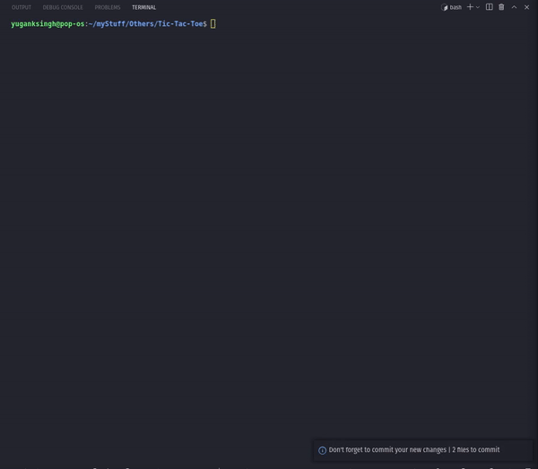

# Java CLI based Tic Tac Toe
This is the first actual cool project I made,
In it I used some simple rules and some cool code trickry to make it feel a little more special,





## What I learned
- Breaking down code into several functions
- Using Java TimeUnit and sleep
- Exiting Code in the middle
- Printing output in a structured way
- Saving Chnages as soon as they are made or using auto saver ( cause I lost a major chunk of code I wrote and had to re-write it.[ I was a noob](https://longreadsblog.files.wordpress.com/2015/03/facepalm.gif))

## Features
- The output is well formatted
- You can use whatever symbol you want
- The Computer Will also form its symbol according to your choice
- The Compute will nag if you win and celebrate like crazy when it'll win.

## How To Download and use


[ **Click To Download the file**](https://github.com/YugankSingh/Tic-Tac-Toe/blob/master/tictactoe.class?raw=true)  
[AlterNatively Download From Here](https://github.com/YugankSingh/Tic-Tac-Toe/blob/master/tictactoe.class)

Then Open Terminal Navigate to this file  
Then Just Run
``` Bash
javac tictactoe
```
\* Make sure that You have Java Installed.